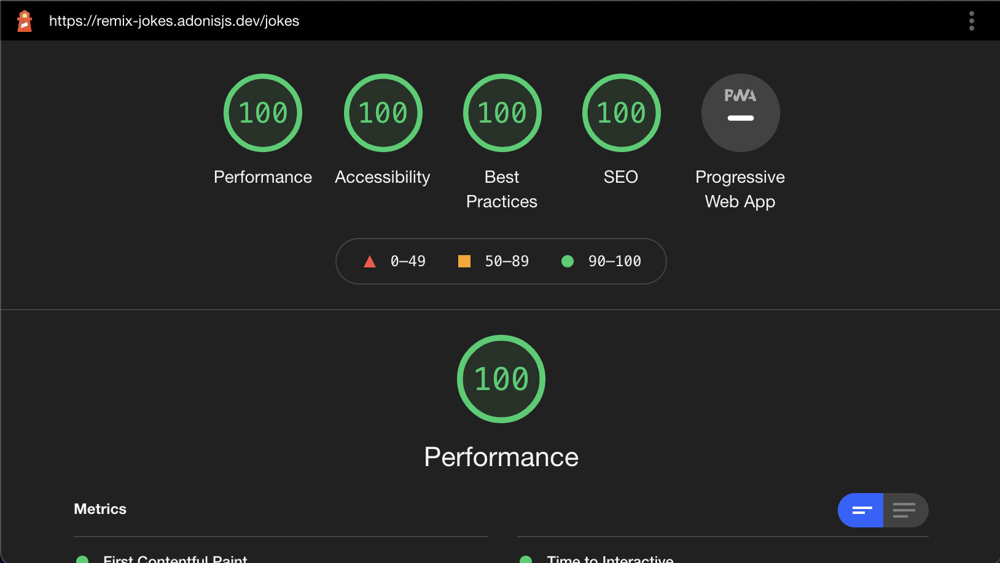

# Remix Jokes App

> A copy of the Remix framework [Jokes app](https://remix-jokes.lol/) built using AdonisJS and Unpoly

The repo contains the source code for a demo application built using AdonisJS and [Unpoly](https://unpoly.com/tutorial). The application's primary goal is to showcase that developers can ship applications with a great user experience without opting for a front-end framework.

## Goal of the application
The goal of the application is not to showcase AdonisJS or its features. Instead, the goal is to showcase [Unpoly](https://unpoly.com/tutorial), a front-end library that uses HTML attributes for performing **partial updates**, **restoring user scroll position**, and a lot more.

Unpoly works as a progressive enhancement on top of your existing Server-side applications. This is how I see Unpoly.

- You begin by using a backend framework. It can be AdonisJS, Rails, Laravel, or any other framework you love.
- You create a standard web application and serve HTML from the server.
- Every time a user clicks a link, it results in the full page reload.
- So far, you have created a working application in the simplest possible way. This app is not inferior at all, but we can improve it.
- Then, you set up Unpoly and instruct it to hijack the navigation and perform partial updates to the DOM vs. reloading the entire page.
- Unpoly takes instructions from the HTML attributes like `up-target`, `up-follow`, `up-submit`, and so on.
- The great thing about this approach is, you can ship the first version of your application without Unpoly and then gradually make navigation between pages smoother.

## What will I learn from this app?

- You will learn how to create a CRUD application using AdonisJS
- Next, use the Unpoly HTML attributes to **perform partial page updates**, **restore user scroll position**, **manage focus** as the user navigates.

## Demo
You can view the application demo at https://remix-jokes.adonisjs.dev.

## Share and love
If you like this application, then please share it with your co-workers and friends or maybe tweet it to the universe :)

## Deployment

The application is deployed on Digital Ocean using [Cleavr](https://cleavr.io/). It runs on a `$5` droplet and the PostgreSQL database running on the same server. 

The static assets are published on Digital ocean spaces and served using a CDN. Take a look at the `commands/PublishAssets.ts` file responsible for publishing the assets on DO spaces. The command is executed during the deployment phase using Cleavr hooks.

## Lighthouse score

